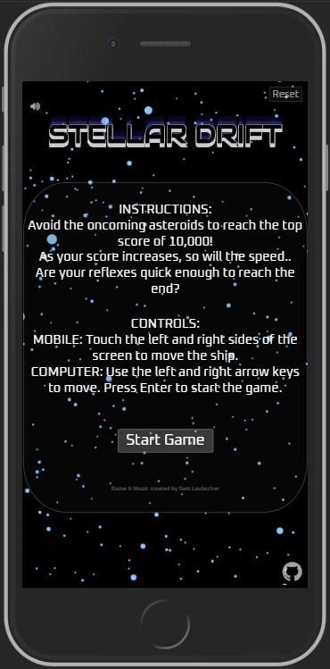

# Stellar Drift | Mini Game

<div align="center">


[View the deployment here](https://samlaubscher.github.io/Stellar-Drift-Game-M2/)

#### An interactive and challenging 3D space themed mini game, built using vanilla javascript!

This project is a responsive and dynamic front end website, demonstrating an ability to effectively understand and impliment the use of multiple programming languages.

##### This project will be submitted for my Interactive Frontend Development project on my Full Stack Software Development course. 
</div>

---
## Table of Contents
* UX 
    * 1

* Features

* Technologies Used 

* Testing 

* Deployment 

* Credits
    * Contents and code
    * Media 
    * Acknowledgements

---
## UX
Stellar Drift is a space themed browser-based mini game where the player is speeding through an asteroid field at a constantly increasing speed meaning the user must guide the ship to avoid the path of oncoming asteroids. The 3D design of the game creates the perspective that the player is moving forwards through space towards the center of the screen and all the stars as they grow closer, growing in size and speed the further out from the center appears to pass the player. 


"The goal of every video game is to present the user(s) with a situation, accept their input, interpret those signals into actions, and calculate a new situation resulting from those acts." - https://developer.mozilla.org/en-US/docs/Games/Anatomy 

### Who is the website for? 

what they want to do


wireframes etc for design process
 
---
## Features 
### **Canvas API graphics animation**
The Canvas API covers the entire screen and 2D graphic shapes and text are rendered onto it using JavaScript. These are then animated in a main loop by calling a specific update callback function to run every frame (roughly 60 times per second) using the browser redraw schedule with *window.requestAnimationFrame(update)*. This update function calls other specific functions containing logical algorhythms which are mostly designed to change certain parameters of the content that the function may render each frame.

### **Animated star background**
Circular shapes used for stars are individually rendered to the canvas using an array of `Star` class objects. Using a for loop, the required number of `starsArray[]` indexes are generated, each iteration instanciating a new `Star` class object, passing in x, y and z constructor arguments of `(Math.random() * canvas.width or height)`. 

```
for (var i = 0; i < numberOfStars; i++) {
    starsArray[i] = new Star(
      Math.random() * cnvsWidth,
      Math.random() * cnvsHeight,
      Math.random() * cnvsWidth
    );
  } 
```

 Within this function below, the entire canvas is cleared to black, and then a for loop iterates over each `starsArray[]` index.

```
function drawStars() {
    if (!endGame) {
      ctx.fillStyle = "#000";
      ctx.fillRect(0, 0, cnvsWidth, cnvsHeight);
    } else {[...]}

    for (var i = 0; i < numberOfStars; i++) {
      starsArray[i].showStar();
      starsArray[i].moveStar();
    }
}
```
The `Star` class contains two additional methods - `moveStar()` and `showStar()`, which are both called on the object each iteration using the function `drawStars()` which is shown above.

```
class Star {
    constructor(x, y, z) {
      this.x = x;
      this.y = y;
      this.z = z;
    } [...]
  ```

In the `showStar()` method, focusing on `xPos`, it takes the value of `this.x` and subtracts half of the screen width `(this.x - centerOfX)`, this allows the value to have an equal potential of being negative or positive. 

`this.z` is `Math.random()*cnvsWidth` so dividing the screen width by the value of `z` has a high possibility of returning a number smaller than 5, this number will only be larger if `Math.random()` generates a number below 0.2 `(cnvsLength / this.z)`.

This first value is then multiplied by the second, and then half of the canvas width is added back on as to shift the zero center mark to the middle of the x axis `xPos = xPos + centerOfX`. When the same has been done for the `yPos`, these are then able to be used for the x and y coordinates of the `arc()` method to draw the circular star shape.

```
[...]

showStar() {
  let xPos = (this.x - centerOfX) * (cnvsLength / this.z);
  let yPos = (this.y - centerOfY) * (cnvsLength / this.z);
  xPos = xPos + centerOfX;
  yPos = yPos + centerOfY;
  let s = size * (cnvsLength / this.z);

  ctx.beginPath();
  ctx.fillStyle = "#82caff";
  ctx.arc(xPos, yPos, s, 0, Math.PI * 2);
  ctx.fill();
}}
  ```

The movement of this code comes from the `this.z` parameter within the `moveStar()` method. Each time the method is called, the value of `this.z` is being reduced by the value of `speed` which in turn affects the resulting value of `xPos`, `yPos` and `s` exponentially, the position and radius of the circular star shape. Each frame the canvas is cleared and then redrawn using slightly different object parameter values, creating the visual illusion - as objects get closer, their size and speed increase rapidly until they pass the observer. 

The smaller the value of `this.z`, the closer to the edge of the screen the object will be, and once the value of `z` reaches 0 and the star has left the screen, an if statement handles setting the value back to `cnvsWidth` which is when the star objects are the smallest and slowest. The `this.x` and `this.y` parameters are also given new values of `Math.random() * cnvsWidth` so that the star objects dont follow the same path each time.

```
[...]

moveStar() {
  this.z = this.z - speed;
  if (this.z <= 0) {
    this.z = cnvsWidth;
    this.x = Math.random() * cnvsWidth;
    this.y = Math.random() * cnvsHeight;
  }
    } [...]
```

Due to both x and y axes being centered in the middle, values moving in positive or negative incrimentations are all displayed as travelling outwards from the center of the screen in any given direction.

### **Animated asteroid sprites**
Asteroid sprites are also rendered to the canvas using an array of `Sprite` class objects. This `spritesArray[]` works the same way as the `starsArray[]` by instanciating each index with a new `Sprite` object, and calling two additional methods on these indexes using a `drawSprites()` function. However, the `Sprite` class contains different code which allows it to behave seperately from the `Star` objects. Each array object is initialised with the `x` and `y` coordinates in the center of the canvas, as well as the constructor method containing additional properties of `this.randomX` and `this.randomY` with the values of `notZeroRange(-10, 10)`.

```
class Sprite {
    constructor(x, y, z) {
      this.x = x;
      this.y = y;
      this.z = z;
      this.randomX = notZeroRange(-10, 10);
      this.randomY = notZeroRange(-10, 10);
    } [...]
```
 The global function `notZeroRange()` allows a random value to be generated within the range of -10 and 10, none inclusive of anything between -1.75 and 1.75. Its use here means the `Sprite` object can only render within this small ranged ring around the center of the screen, avoiding 0 which causes sprites to hit the center and fill the entire screen suddenly. This creates a type of visual tunnel that the sprites can travel down.

```
  function getRandom(min, max) {
    return Math.random() * (max - min) + min;
  }

  function notZeroRange(min, max) {
    if (getRandom(0, 1) > 0.5) {
      return getRandom(min, -1.75);
    } else {
      return getRandom(1.75, max);
    }
  }
```
The `moveSprite()` method remains the same, except the `speed` has been halved and there are fresh `notZeroRange()` values called each time the `z` index resets for a new `Sprite` to be generated. The `speed` has been halved so that the background remains more engaging whilst the sprites are not too fast for the player. 

``` 
    [...]

    moveSprite() {
      this.z = this.z - speed / 2;
      if (this.z <= 0) {
        this.z = cnvsWidth;
        this.randomX = notZeroRange(-10, 10);
        this.randomY = notZeroRange(-10, 10);
      }
    } [...]
```
Within the `showSprite()` method, the movement is implimented differently through the use of `s` which is abbreviated for size or radius. `xPos` and `yPos` are set to the center of the canvas, and the `s` variable initially holds the only value that changes due to the use of `this.z`. When `s` is added to the `xPos` and `yPos`, that value is then multiplied by `this.randomX` or `this.randomY` which is one of these uniquely random generated values between -10 and 10 excluding -1.75-1.75. This means the incrimentations of each `xPos` and `yPos` values happen smoothly on a curve, and movement occurs within this much more limited range. Size ultimately governs the speed and movement of the `Sprite` objects, they can grow much larger than `Stars`, and as they expand they rapidly increase in speed and suddenly move very quickly away from the center and off the screen. This makes it look like the player is travelling much closer to the `Sprites` than the `Stars`.

At the bottom of the `showSprite()` method sits the invocation of the `collisionDetection()` function, directly passing in the arguments of `xPos` and `yPos` as to allow these parameter values to be used outside of the class scope and inside the `collisionDetection()` function.

```
    [...]

    showSprite() {
      if (score >= 0) {
        let xPos = this.x;
        let yPos = this.y;
        let s = (size / 2) * (cnvsLength / this.z);

        xPos = xPos + s * this.randomX;
        yPos = yPos + s * this.randomY;

        ctx.beginPath();
        if (score <= 2400) {
          ctx.fillStyle = "red";
        } else if {[...]}
        ctx.arc(xPos, yPos, s, 0, Math.PI * 2);
        ctx.fill();

        collisionDetection(xPos, yPos);
}}}
```

### **Player ship movement**
The player ship is created using a combination of circular and triangular shapes rendered onto the canvas using the `arc()` and `lineTo()` methods. These shapes are rotated around the center of the canvas using `translate()` and `rotate()` methods.

First the entire state of the canvas is saved using the `save()` method. Next the `translate(centerOfX, centerOfY)` method is called which moves the canvas and its origin to the center of the screen. The `rotate()` method is then used with the argument of `convertToRadians(angle)`, meaning `angle` will correlate to the amount of rotation around this center point.

The shapes are then rendered onto the canvas using its new origin point. The ship would be located in the top left hand corner of the screen without this `translate()` method due to the parameter values of `x1 = 0` for example. Each of the `y` values include `centerOfY / 2`, used to drop the ship into the lower quarter of the screen, allowing for a perfect ship rotation around this bottom quarter ring once translation transformation has taken place.

Once all player ship shapes have been rendered, we dont want any other canvas content to be manipulated by this transformation, so the `restore()` method must be used to bring the canvas state back to how it was originally when `save()` was called. This is the same as effectively reversing the transformation methods and calling `translate()` and `rotate()` with the opposite values each time to revert it to its original state, however `restore()` is a much simpler, and more precise method to achieve this.

```
function playerShip() {
    x1 = 0;
    y1 = 0 + centerOfY / 2;
    x2 = 50;
    y2 = 0 + centerOfY / 2 + 30;
    x3 = -50;
    y3 = 0 + centerOfY / 2 + 30;
    s = 14;

    ctx.save();
    ctx.translate(centerOfX, centerOfY);
    ctx.rotate(convertToRadians(angle));

    // Under Glow
    ctx.beginPath();
    ctx.fillStyle = "Violet";
    ctx.moveTo(x1, y1 - 1);
    ctx.lineTo(x2 + 5, y2 + 5);
    ctx.lineTo(x3 - 5, y3 + 5);
    ctx.fill();

    // small engine light right
    ctx.beginPath();
    ctx.fillStyle = "white";
    ctx.arc(x1 + 38, y2 - 3, s / 2, 0, Math.PI * 1);
    ctx.fill();
    
    [...]

    ctx.restore();
  }
```

### **Player ship controls**
The player ship can be rotated around the screen using left and right arrow buttons via `keydown` and `keyup` event listeners on computer, or touching the left and right halves of the screen on mobile and tablet devices with `touchstart` and `touchend` event listeners.

The rotation is achieved by increasing the value of the global variable `angle`. This is used in the `rotation(convertToRadians(angle))` method to control the canvas rotation as explained in ###Player ship movement. When the angle increases above 360, it resets to 0. `setInterval()` is used to remove the delay in movement after initial keydown which would stop the player having instant sustained movement. This also enables the function to be called 100 times a second which allows the ship to move smoothly at a much higher speed.

```
function moveLeft() {
    time = setInterval(function () {
      angle += 2;
      if (angle > 360) {
        angle = 0;
      }
    }, 10);
  }
```

### **Collision detection**
In order to detect the collision of both the `playerShip()` and `Sprite` objects, I first had to generate the correct canvas position values for the `playerShip()`. The use of transformation methods `translate()` and `rotate()` in the rendering of `playerShip()` meant that it followed its own X and Y coordinates seperate from any other canvas content. 

I wanted to create an array to store the data for each of the X and Y positions of the ship, then matched them against the coordinates of each of the sprites per frame. I undertook an enourmous job of trying to manually create all of these postions, physically using paper graphs and plotting each of the points along the axes, then doing the maths to create a canvas circle shape along these points on screen. Below are some of my workings.

<div align="center">


</div>

I began to write function that stores and returns an array of each of the numbers associated with the corresponding angle.

```
function getAngleNumber(angle) {
    if (angle == 0 || angle == 90 || angle == 180 || angle == 270) {
      return [1.0, 0.0];
    } else if (angle == 6 || angle == 96 || angle == 186 || angle == 276) {
      return [0.1, 0.99];
    [...]
```
But then quickly realised that this was a very innefficient, and innacurate way of achieving this. Thats when I discovered that I could use `Math.cos()` and `Math.sin()` together to quickly and extremely accurately generate all of these values for me.

```
function getAngleNumber(angle) {
    const angleInRadians = (angle * Math.PI) / 180;
    return [Math.cos(angleInRadians), Math.sin(angleInRadians)];
  }
```
When dealing with the ship moving to the right, the value of `angle` becomes negative, and resets to 0 when it passes -360. In order to always return a positive value, and that the 0 mark was correct with the rotation of the ship, I created the `getActualAngle()` function with the argument of `angle`.

```
  function getActualAngle(angle) {
    if (angle >= 0 && angle < 270) {
      return angle + 90;
    } else if (angle >= 270) {
      return angle - 270;
    } else if (angle >= -90 && angle < 0) {
      return 360 + angle - 270;
    } else {
      return 360 + angle;
    }
  }
```
The `getAllPossibleShipLocations()` function outputs the value of `shipLocations[]`, containing both the X and Y coordinates in each array itteration from 0 - 360. `getShipLocation(angle)` then takes the input of angle and calls the array itteration associated with that value of angle.

First I needed to create an algorythm that would perform the operations used in this plotting `ctx.arc(centerOfX + (0.4*shipFromCenter), centerOfY + (0.92*shipFromCenter), s, 0, Math.PI*2)`. 

Returning the `Math.cos()` and `Math.sin()` values from the `getXShipValue()` and `getYShipValue()` functions allows the values to remain positive.
```
  function getAllPossibleShipLocations() {
    let shipLocations = {};
    function getXShipValue(angle) {
      let actualAngle = getActualAngle(angle);
      if (actualAngle >= 0 && actualAngle <= 360) {
        return getAngleNumber(angle)[0];
      } else {
        return -getAngleNumber(angle)[0];
      }
    }
    
    function getYShipValue(angle) {
      let actualAngle = getActualAngle(angle);
      if (actualAngle >= 0 && actualAngle <= 360) {
        return getAngleNumber(angle)[1];
      } else {
        return -getAngleNumber(angle)[1];
      }
    } [...]
```
The maths is then performed on the values based on my plotting - `(centerOfX + (0.4*shipFromCenter), centerOfY + (0.92*shipFromCenter)`. 
```
    [...]

    function generateX(angle) {
      let shipValue = getXShipValue(angle) * shipFromCenter;
      return centerOfX + shipValue;
    }

    function generateY(angle) {
      let shipValue = getYShipValue(angle) * shipFromCenter;
      return centerOfY + shipValue;
    } [...]
```
A `for` loop then assigns the `[generateX(i), generateY(i)]` array values to `shipLocations[]` with the corresponding array index. When `getAllPossibleShipLocations()[i]` is then called, it is returning `shipLocations[i]`.
```
    [...]

    for (i = 0; i < 360; i++) {
      let angleKey = i.toString();
      shipLocations[angleKey] = [generateX(i), generateY(i)];
    }
    return shipLocations;
  }
```
`getShipLocation(angle)` takes in `angle`, processes it through another instance of the `getActualAngle()` function to make sure it is postive and the correct value as explained before, and then assigns it to `actualAngle` as a string. This string is then used as the array index for returning `getAllPossibleShipLocations()[i]` when `getShipLocation(angle)[i]` is called in the collision detection function next.
```
  function getShipLocation(angle) {
    function getActualAngle(angle) {
      [....]
    }
    let actualAngle = getActualAngle(angle).toString();
    return getAllPossibleShipLocations()[actualAngle];
  }
  ```
The `collisionDetection(xPos, yPos)` function was called in the `showSprite()` method of the `Sprite` class. It takes in the arguments of `xPos` and `yPos` which are each of the `Sprite` objects X and Y positions on the canvas per frame. If `playerShip()` occupies the exact same X and Y coordinates as a `Sprite`, subtracting the `xPos` and `yPos` values from both array items `getShipLocation(angle)[0]` and `getShipLocation(angle)[1]` will result in 0. 

The code unfortunately is not accurate enough to use this method without a range, the reason for this is due to the speed of the `Sprite` objects as they reach the outer path of rotation. They have grown so much in size that they can move in steps of up to 60px per frame, therefore a range of 100px has been given to allow for a more reliable detection rate. The origin of collision range for the `playerShip()` is the front tip of the triangle.

  ```
  function collisionDetection(x, y) {
    if (
      x - getShipLocation(angle)[0] <= 50 &&
      x - getShipLocation(angle)[0] >= -50 &&
      y - getShipLocation(angle)[1] <= 50 &&
      y - getShipLocation(angle)[1] >= -50
    ) {
      crashScreen();
    }
  }
```

### Start Screen





### Start game button

### Crash screen
### Completed screen
### Mute audio button
### Reset button 
### Github social icon
### Score counter
### Speed increase
### Colour changing
### Theme music
### Sound effect

## Features Left to Impliment
* Display score history - backend 
* Leaderboard with player name input
* Stop the background music from restarting when the game is restarted
* Better colour transitions
* Tighter collision detection

## Technologies Used
mention the tools used - provide link
#### JavaScript
#### HTML/HTML 5 
#### CSS/CSS3
#### VSCode 
#### Canvas API


## Testing 
convice that enough testing has been done that it works.
go over the user stories for ux and insure they work
use scenarios like clicking contact button, trying to submit empty form etc
use automated tests and show results 
#### bugs 
explain bugs i found and fixed 
bugs that still exist 

## Deployment
explain the process taken to deploy the page

## Credits
### Content and code
reference to bits used
### Media
explain where any media came from 
### Acknowledgements 
acknowledge mentor and students in slack