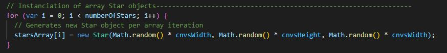
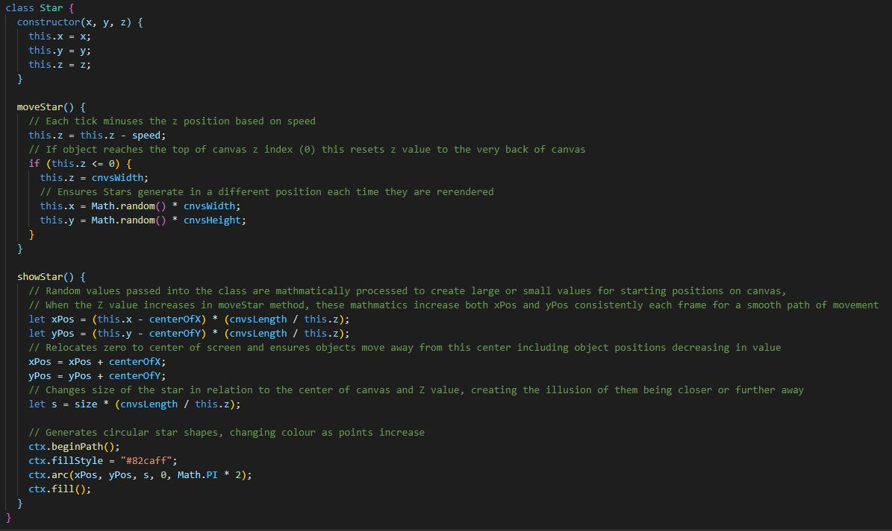
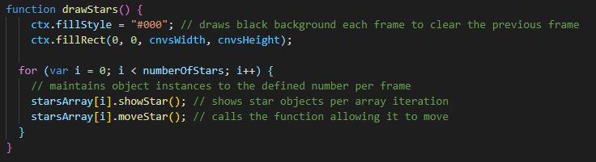

# Stellar Drift | Mini Game

[View the deployment here](https://samlaubscher.github.io/Stellar-Drift-Game-M2/)

#### An interactive and challenging 3D space themed mini game, built using vanilla javascript!

This project is a responsive and dynamic front end website, demonstrating an ability to effectively understand and impliment the use of multiple programming languages.

##### This project will be submitted for my Interactive Frontend Development project on my Full Stack Software Development course. 

## Table of Contents
* UX 
    * 1

* Features

* Technologies Used 

* Testing 

* Deployment 

* Credits
    * Contents and code
    * Media 
    * Acknowledgements

## UX
Stellar Drift is a space themed browser-based mini game where the player is speeding through an asteroid field at a constantly increasing speed meaning the user must guide the ship to avoid the path of oncoming asteroids. The 3D design of the game creates the perspective that the player is moving forwards through space towards the center of the screen and all the stars as they grow closer, growing in size and speed the further out from the center appears to pass the player. 

"The goal of every video game is to present the user(s) with a situation, accept their input, interpret those signals into actions, and calculate a new situation resulting from those acts." - https://developer.mozilla.org/en-US/docs/Games/Anatomy 

### Who is the website for? 

what they want to do

wireframes etc for design process
 

## Features 
### Canvas API graphics animation
The Canvas API covers the entire screen and 2D graphic shapes and text are rendered onto it using JavaScript. These are then animated in a main loop by calling a specific update callback function to run every frame (roughly 60 times per second) using the browser redraw schedule with *window.requestAnimationFrame(update)*. This update function calls other specific functions containing logical algorhythms which are mostly designed to change certain parameters of the content that the function may render each frame.

### Animated star background
Circular star shapes are individually rendered to the canvas using an array of Star class objects. Using a for loop, the required number of these array indexes are generated, each iteration instanciating a new Star class object, passing in unique x, y and z constructor arguments of *(Math.random() * canvas.width or height)*. 

The Star class contains two methods - *moveStar()* and *showStar()*, which are both called on the object each frame using the *drawStars()* function. The mathmatical equations that are contained inside these methods create the logic of movement and can be best explained if briefly broken down and demonstrated frame by frame. 

Example - (canvas width 1200px, height 700px)

 *starsArray[i] = new Star(Math.random() * cnvsWidth,[...]*

*this.x = (Math.random() * cnvsWidth)* `0.2921 x 1200px = 350.52`

*this.y = (Math.random() * cnvsHeight)* `0.6397 x 700px = 447.79`

*this.z = (Math.random() * cnvsWidth)* `0.3647 x 1200px = 437.64`

*moveStar* takes the z value and decreases it by the value of *speed* once. 

*speed = 10* `437.64 - 10 = 427.64`

Within the *showStar* method, *xPos* takes the previously generated value of the *x* property and subtracts half of the screen width from this number - the canvas width is divided by the value of the *z* property, and this first result is then multiplied by the second result.

*let xPos = (this.x - centerOfX) * (cnvsLength / this.z);*

`xPos = (350.52 - 600) * (1200 / 427.64) = -700.0408`

*let yPos = (this.y - centerOfY) * (cnvsLength / this.z);*

`yPos = (447.79 - 350) * (1200 / 427.64) = 274.39874`

The 0 center mark is then translated to the center of the x-axis by adding half of the canvas width to any resulting *xPos* value, allowing the stars to have both positive and negative position values visible on the canvas.

*xPos = xPos + centerOfX;*

`xPos = -700.0408 + 600 = -100.0408`

*yPos = yPos + centerOfY;*

`yPos = 274.3987 + 350 = 624.3987`

The s variable is then declared with the value of *size* multiplied by the result of canvas length divided by the z property. 

*let s = size * (cnvsLength / this.z);*

`s = 1 * (1200 / 427.64) = 2.8060`

These new *xPos* , *yPos* and *s* values are then used as the x y and radius parameters to render a circle using the arc() drawing method. We now have a visible star object positioned randomly on the canvas with these values:- 

*xPos = -100.0408, yPos = 624.3987, s = 2.8060*

`ctx.beginPath(); ctx.fillStyle = "#"; ctx.arc(xPos, yPos, s, 0, Math.PI * 2); ctx.fill(); }`

Each *starsArray[i]* index of the array should now contain a Star object that followed the same logic and has random x,y and s values. This means that if the number of stars was set to 1,000, there will now be exactly 1,000 array instances containing randomly positioned star objects visibly generated across the canvas on this frame. 

When the *update()* function is then called on the next frame, *drawStars()* is the first function triggered which first clears the entire canvas of all visible objects by filling it with a blank background colour (#000), and then rerenders everything by fresh, calling *.showStar()* and *.moveStar()* methods on each of the *starsArray[i]* index objects. 

--------------------------- 
need tofdsfdsfsdfsdfsdfsdf

 An if statement handles when the value

The Star class takes three arguments for x, y and z values

### Animated asteroid sprites
* Player ship movement
* Player ship controls
* Collision detection
* Start screen
* Start game button
* Crash screen
* Completed screen
* Mute audio button
* Reset button 
* Github social icon
* Score counter
* Speed increase
* Colour changing
* Theme music
* Sound effect

## Features Left to Impliment
* Display score history
* Leaderboard with player name input
* Stop the background music from restarting when the game is restarted
* Better colour transitions
* Tighter collision detection

## Technologies Used
mention the tools used - provide link
#### JavaScript
#### HTML/HTML 5 
#### CSS/CSS3
#### VSCode 
#### Canvas API

## Testing 
convice that enough testing has been done that it works.
go over the user stories for ux and insure they work
use scenarios like clicking contact button, trying to submit empty form etc
use automated tests and show results 
#### bugs 
explain bugs i found and fixed 
bugs that still exist 

## Deployment
explain the process taken to deploy the page

## Credits
### Content and code
reference to bits used
### Media
explain where any media came from 
### Acknowledgements 
acknowledge mentor and students in slack